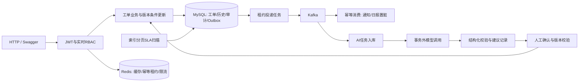

# OpsFlow架构与一致性边界

一个Spring Boot应用，按业务分包，MySQL保存业务事实；Redis是可丢失的辅助设施，Kafka承载异步事件。第一版使用Swagger，不包含聊天机器人或微服务拆分。

| 边界 | 实现与限制 |
|---|---|
| 创建/状态变化 | 工单、历史、审计、Outbox同一本地事务；回滚时没有独立成功的事件 |
| 状态竞争 | SQL同时检查状态与version，冲突返回409；组内分配短事务锁组行，按活动负载、最后分配时间、ID选择客服 |
| 消息发送 | SKIP LOCKED领取短租约，事务外等待broker ACK，之后标记SENT；崩溃可能重复发送，属于at-least-once |
| 消息消费 | consumer_name+eventId唯一约束及payload摘要，去重与副作用同事务；有限重试、异常记录、DLT、管理员审计重放 |
| SLA | 创建时固化规则及UTC deadline，24×7自然时间；扫描使用状态/deadline索引与游标，独立记录违约和升级，不添加非法业务状态；完成操作补记扫描间隔内的违约 |
| Redis | 详情30秒TTL且每次复核权限，事务提交后失效；创建用数据库唯一请求键与原始响应兜底；固定窗口限流，登录保护故障拒绝、普通业务回源 |
| AI | 三种明确DTO，JSON Schema加服务端校验；独立消费组入库，90秒任务租约，调用在事务外；失败不回滚工单，分类/回复必须人工采纳且版本匹配 |
| 统计 | 概览直接聚合事实表，日报按日期重算；事件幂等置脏、分类跨组修改同事务标记历史日期；不消费一次就盲目加一 |

普通用户只能读取自己的工单；客服看负责工单，组长看负责组，管理员看全局。JWT每次请求重新读取当前账号与角色，停用及撤权立即生效。内部备注与AI客服草稿不暴露给普通用户；附件只有授权下载路径。

第一版的边界：单节点依赖不能证明高可用；附件为本地磁盘，未做病毒扫描；PENDING不暂停SLA、只升到组长；列表使用有上限的offset分页；没有工作日历、RAG、Agent和分析型数据库。AI工作任务默认每2秒处理1条，外部模型关闭时仍可积压并逐条标记DISABLED；这个吞吐上限与Kafka消费lag不同，当前实现未宣称大规模AI处理能力。

运行、接口及配置见README；数据库索引见database-design.md；故障结果、未验证边界与硬件条件见performance.md。
